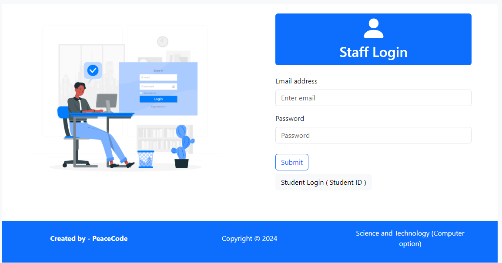
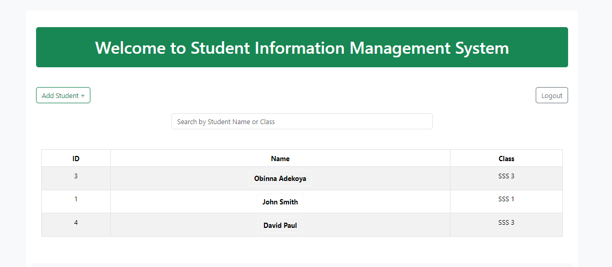
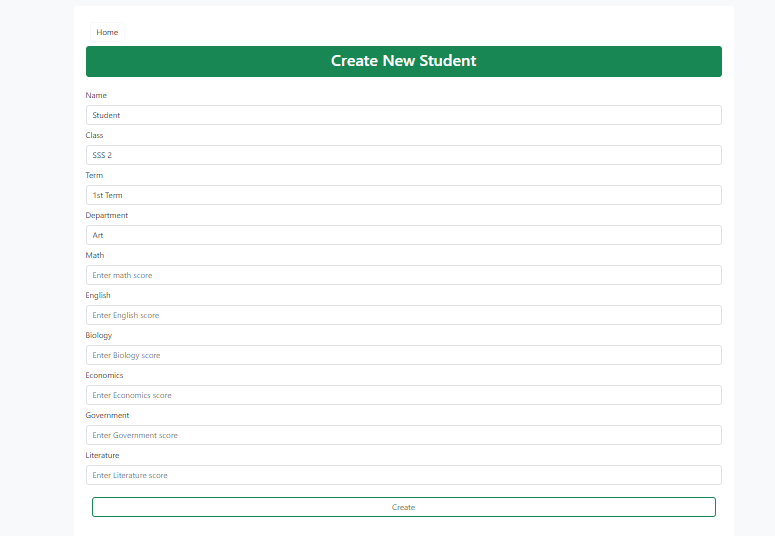
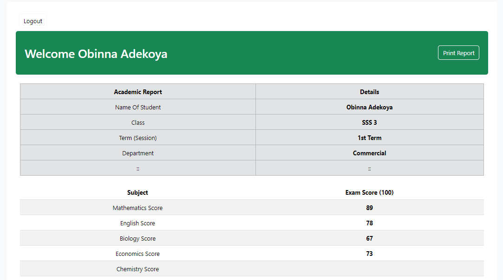
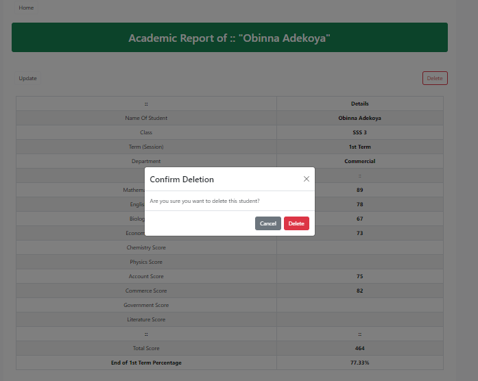

# Student Management System CRUD

## Description
The Student Management System CRUD is a React-based web application designed to manage student information efficiently. It allows administrators and staff to perform various CRUD (Create, Read, Update, Delete) operations on student records, providing a seamless user experience. The project also includes login functionality for both staff and students, with dynamic user interfaces tailored to each role.

---

## Features

- **Staff and Student Login:**
  - Staff login via email and password.
  - Student login via Student ID.
- **CRUD Operations:**
  - Add, view, update, and delete student records.
- **Search Functionality:**
  - Filter students by name or class.
- **Responsive Design:**
  - Fully responsive and mobile-friendly layout using Bootstrap.
- **Secure Backend:**
  - A Node.js backend with PostgreSQL database.

---

## Screenshots

1. **Login Page**
   
   
   - A user-friendly login interface for both staff and students.

2. **Home Page**
   
   - A dashboard displaying student information and CRUD options.

3. **Add Student**
   
   - A form for adding new students to the system.

4. **Students Page**
   
   - A student page to access and print their result.

5. **Delete Confirmation**
   
   - A modal to confirm student deletion.

---

## Technologies Used

### Frontend
- React.js
- React-Bootstrap
- React Router

### Backend
- Node.js
- Express.js

### Database
- PostgreSQL

### Others
- RESTful API
- Render (Deployment)

---

## Setup Instructions

### Prerequisites
- Node.js installed on your system
- PostgreSQL database setup
- Git for cloning the repository

### Steps
1. Clone the repository:
   ```bash
   git clone https://github.com/arakunle22/studentMgt-CRUD.git
   ```
2. Navigate to the project directory:
   ```bash
   cd studentMgt-CRUD
   ```
3. Install dependencies:
   ```bash
   npm install
   ```
4. Set up the backend:
   - Create a `.env` file in the backend directory and add your database connection details:
     ```
     DB_URL=your_database_url
     ```
5. Start the backend server:
   ```bash
   node backend/server.js
   ```
6. Start the React app:
   ```bash
   npm start
   ```
7. Access the application in your browser at `http://localhost:3000`.

---

## API Endpoints

### Authentication
- `POST /login` - Login for staff and students.

### Students
- `GET /students` - Retrieve all students.
- `GET /students/:id` - Retrieve a specific student by ID.
- `POST /students` - Add a new student.
- `PUT /students/:id` - Update a student's details.
- `DELETE /students/:id` - Delete a student.

---

## Future Enhancements
- Add role-based authentication.
- Implement additional search filters.
- Include a reporting module for analytics.

---

## Author
**PeaceCode**  
- GitHub: [arakunle22](https://github.com/arakunle22)

